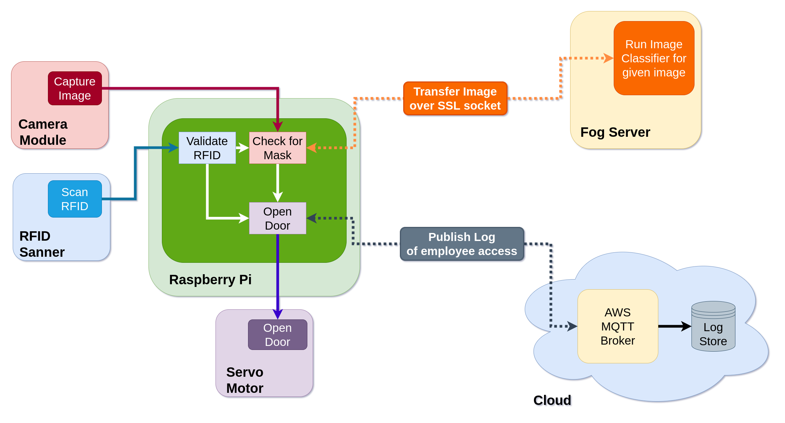

Maskit
======

A smart COVID-19 mask detection system built for use in public workspaces!

As COVID-19 grows to be threat to reopening of economies, we must ensure to take preventive measures while moving about in public spaces, especially workspaces like colleges and offices. Our project aims to help ensure a few of the directed standard operating procedures (SOPs) to tackle COVID-19. We do so by ensuring employees/students/personals in public spaces are wearing their masks to avoid spread of germs and the virus.

We add this safety check to security mechanisms that already exist in workspaces (ID scanners). Most office workspaces make use of an RFID scanner which validates identity of an individual before providing access into the office. Maskit is a similar such device, which can identify and validate a person’s identity through RFID scans and additionally verify if the person is or is not wearing a mask. If the said person does have a valid identity (allowed to enter premises) and is following SOPs by wearing a mask which covers his/her mouth and nose, only then do we allow the person entry into the premises.

In performing such checks, we aim to smoothen and enforce guidelines which help people avoid the spread of the treacherous virus.

Architecture
============



The architecture of the project has been visualized above. We make use of a Raspberry Pi as the primary micro controller. The Pi is connected to 2 sensors, an RFID Scanner and a Camera Module. The Pi is also connected to 1 actuator, the Servo Motor (the door).

Additionally, the Pi connects to a close proximity Fog Server through a secure socket connection. It also connects to the Cloud through an active MQTT connection.

For simplicity of reading, the following terms are abbreviated.

| Word             | Abbreviation |
|------------------|--------------|
| Raspberry Pi     | Pi           |
| Pi Camera Module | Pi Cam       |
| Servo Motor      | Servo        |
| Fog Server       | Server       |

Workflow
--------

-	RFID Scanner: The RFID scanner is used to scan ID Cards/RFID tags to verify identity of employees/students that wish to enter the workspace premises. Scanned RFID details are sent to the Pi for further processing and validation.

-	Camera Module: On successful RFID validations, the camera captures an image of the card holder and stores the image in the Pi for later classification.

-	Fog Server: The fog server is used to run compute intensive image classification algorithms which are not possible on the Pi. On capturing an image, the Pi sends the image to this server, through a secure connection (TCP Socket with SSL encryption). Upon receiving this image, the fog server, runs the classification algorithm on this image, to determine whether or not, the card holder is wearing a mask.

-	MQTT Broker (Cloud): The MQTT Broker runs as a hosted IoT core service on AWS. We make use of this to log details about employees/students that move in and out of the workspace.

-	Actuators: The only actuator present here, is the Servo Motor, which is used to simulate the function of opening a door and allowing access for an employee/student.

Prerequisites
=============

-	Raspberry Pi

-	Pi Camera Module

-	RFID Scanner (RC522)

-	Servo Motor

-	AWS account (For attendance logging using AWS IoT Core)

Required Setup
==============

Hardware
--------

Connect the servo motor to the Pi according to the given pin layout.

| Servo Pin   | Raspberry Pi PIN |
|-------------|------------------|
| VCC (3.3 V) | 1                |
| Ground      | 6                |
| Data        | 11               |

Connect the RFID scanner to the Pi according to the below pin layout.

| RFID Pin    | Raspberry Pi PIN |
|-------------|------------------|
| SDA         | 24               |
| SCK         | 23               |
| MOSI        | 19               |
| MISO        | 21               |
| IRQ         | No connection    |
| GND         | 30               |
| RST         | 22               |
| VCC (3.3 V) | 17               |

-	Connect the Pi camera module to the Pi using the camera socket.

Network
-------

-	Connect the Pi to the same network the server runs on.

-	Generate required certificates for AWS IoT core to recognise the Pi as a "thing". Instructions for this setup and generation of certificates can be found [here](https://youtu.be/kPLafcrng-c).

-	After generation of certificates, variables in client.py, `logToCloud()` must be set accordingly.

#### NOTE: Ignore the last two steps if logging to AWS using MQTT is not needed (Additionally, comment out the `logToCloud()` function in client.py and all associated calls to the function).

Usage
=====

Clone the repo.

```
git clone https://github.com/Gituser143/Maskit.git
```

### NOTE: Place the `server/` directory in the server and the `pi/` directory on a raspberry Pi.

Server configuration
--------------------

Navigate into `server/` on the server and generate an SSL certificate. Fill in the required fields.

```
cd server
openssl req -new -x509 -days 365 -nodes -out cert.pem -keyout cert.pem
```

The above command places a `cert.pem` in your local directory.

Install requirements on server.

```
pip3 install -r requirements.txt
```

Start the server.

```
python3 server.py
```

Client configuration
--------------------

Navigate into the `pi/` directory on a raspberry Pi.

```
cd pi
```

Install requirements on Pi.

```
pip3 install -r requirements.txt
```

Start client.

```
python3 client.py
```

### Voila! That should be all!

<!-- Credits
=======

-   [Chandrika Deb](https://github.com/chandrikadeb7) for the brilliant [Face Mask Detection](https://github.com/chandrikadeb7/Face-Mask-Detection) system.

-   [Rishab Kattimani](https://github.com/RishabKattimani) for the awesome [YouTube video](https://youtu.be/kPLafcrng-c) explaining a use case of AWS IoT core with Raspberry Pi. -->
